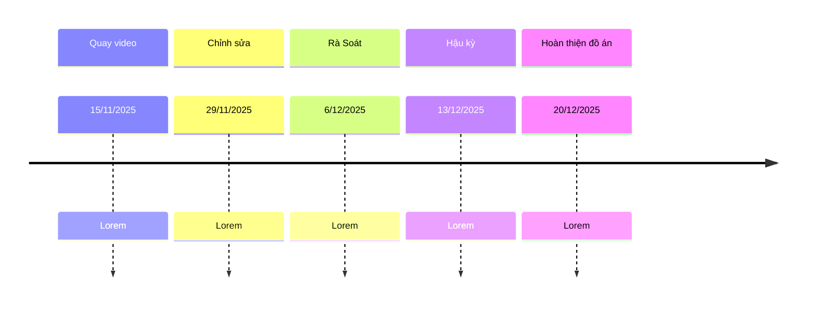

---
# try also 'default' to start simple
theme: apple-basic
# random image from a curated Unsplash collection by Anthony
# like them? see https://unsplash.com/collections/94734566/slidev
image: 1.jpg
# some information about your slides (markdown enabled)
title: Bảng vẽ - bút vẽ
# apply UnoCSS classes to the current slide
layout: intro-image
# https://sli.dev/features/drawing
drawings:
  persist: false
# slide transition: https://sli.dev/guide/animations.html#slide-transitions
transition: slide-left
# enable MDC Syntax: https://sli.dev/features/mdc
mdc: true
# duration of the presentation
preload: true
---

  
    Nhóm 1 - 8 con báo Độc Nhất Vô Nhị lên đỉnh Olympius
  

  <h1 bg="black op-50" >Báo cáo tiến độ đồ án</h1>
  
 Lần 1 

<!--
The last comment block of each slide will be treated as slide notes. It will be visible and editable in Presenter Mode along with the slide. [Read more in the docs](https://sli.dev/guide/syntax.html#notes)
-->

---
layout: intro
class: px-35
glowSeed: 205
---

# Thành viên & Vai trò

  

    
    Nguyễn Khải Toàn
    

      

        Thành viên
      

      

        
25127158
      

    

  

  

  

    
    Nguyễn Quốc Khánh
    

      

        Thành viên
      

      

        
25127076
      

    

  

  

  

    
    Mai Trung Hiếu
    

      

        Thành viên
      

      

        
25127329
      

    

  

---
layout: intro
class: px-35
glowSeed: 205
---

  

    
    Trần Kiến Quốc
    

      

        Nhóm trưởng
      

      

        
25127486
      

    

  

  

  

    
    Hiếu Anh Thư
    

      

        Thành viên
      

      

        
25127240
      

    

  

  

  

    
    Võ Trần Nhật Hạ
    

      

        Thành viên
      

      

        
25127043
      

    

  

---
layout: intro
class: px-35
glowSeed: 205
---

  

    
    Đàm Anh Tuấn
    

      

        Thành viên
      

      

        
25127542
      

    

  

---
class: py-10
glowSeed: 100
---

# Vấn đề
Những vấn đề nhóm mong muốn giải quyết trong cuộc họp này

  

    

      

      Kịch bản
    

    

      

        

        

          
Nội  dung

          
Kịch bản còn thô sơ

        

      

      

        

        

          
Thông điệp

          
Nhóm chưa làm cô đọng kịch bản thành một câu thông điệp ngắn gọn được

        

      

    

  

  

    

      

      Sản xuất
    

    

      

        
 Nhóm chưa bàn luận trọn vẹn về những vấn đề sau khi có kịch bản như

        

          

          Bối cảnh
        

        

          

          Diễn viên
        

        

          

          Trang phục
        

                

          

          Chi phí
        

        

          

          Quay dựng
        

        

          

          Hậu kỳ
        

      

      

    

---

# Timeline

---
class: py-10
clicks: 5
glow: left
---

# Kế hoạch

Các kế hoạch của nhóm

  

    

      

        

        Tài chính
      

      

        

          

          Nhà hảo tâm: Trần Kiến Quốc & Võ Trần Nhật Hạ
        

        

          

          Tận dụng những bối cảnh và dụng cụ quay có sẵn, hai nhà hảo tâm sẽ tài trợ phần lớn tài chính vào nhóm để hỗ trợ những thành viên còn lại.
        

      

    

    

      

        

        Thực hiện
      

      

        

          

          Trước tuần diễn, thành viên đảm nhiệm chuẩn bị đạo cụ quay. Bàn bạc và chốt về trang phục.
        

        

          

          Trước 3 ngày diễn, nhóm trưởng thông báo mọi người học thuộc kịch bản.
        

      

    

    

      

        

        Liên lạc
      

      

        

          

          Thông báo trước ít nhất 1 tuần về địa điểm quay thông qua Messenger. Các thành viên sẽ gửi emoji hoặc phản hồi tin nhắn để được đánh dấu là đã nhận được tin nhắn.
        

      

    

  

  

    

      

        
Lấy ý kiến

          

            

            Nhóm tích cực nghe ý kiến từ thầy cô và các bạn sau buổi xem video, rút ra những bài học quý giá cho những dự án của các môn sau này, mọi thành viên trong nhóm sẽ hướng đến những kinh nghiệm quý báu cho tương lai sau này.
          

      

    

  

